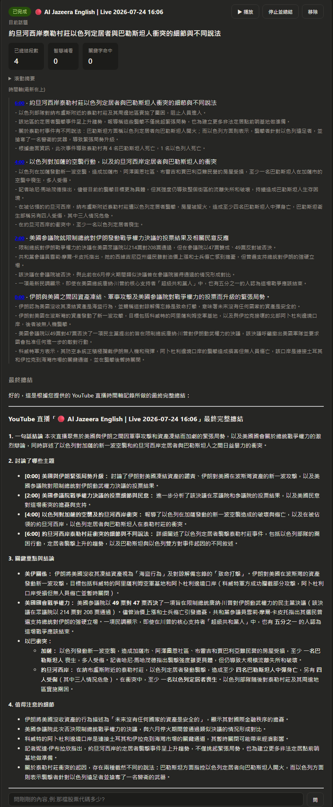
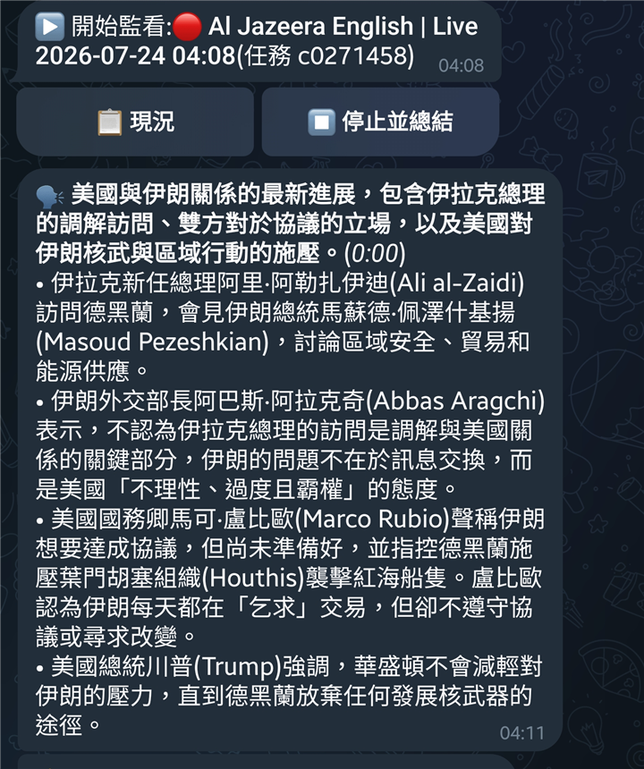

# autoliveblog

[](https://github.com/casper88/autoliveblog/actions/workflows/ci.yml)
[](LICENSE)
[](https://www.python.org/)

YouTube 直播與影片的 AI 總結工具 — 直播即時滾動總結(含畫面智慧補看)、補課模式、頻道訂閱、Telegram 機器人、每日晨報。

[English](README.md)



## 這是什麼

貼一個 YouTube 直播網址,它就在背景幫你「看」:每幾分鐘聽一段音訊、追蹤話題轉換、推播到 Telegram。講者說「看這張圖」時,模型會自己要求看那個時間點的畫面截圖,讀出盤面數字、股票代碼、字卡。錯過開頭?一鍵從直播最開始補課,追上後無縫接續即時總結。直播結束自動產出完整報告。



每則推播都帶按鈕,不用記得任務 ID 也不會按錯對象。

## 功能

- **直播模式** — 每 N 分鐘滾動總結、斷線自動重連、停滯看門狗、結束自動產出最終報告
- **智慧補看** — 模型自主要求特定時間點的截圖並讀取畫面資訊;重要畫面會保留並附在推播裡
- **補課模式**(`--from-start`)— 從直播開頭總結,追上後接續即時
- **影片 / Podcast 模式** — 字幕優先(免費快速),無字幕退音訊理解,長音訊自動分段彙整
- **頻道訂閱** — 開播推播通知,按一下按鈕才開始總結(不會自動燒額度)
- **Telegram 機器人** — 訊息內建按鈕、隨時查現況、針對內容問答、語意關鍵字警報
- **每日晨報** — 當天所有總結彙整成一份報告
- **跨影片問答** — 對所有歷史總結提問(「某頻道這個月對台積電的看法變化?」)
- **頻道專有名詞辭典** — 根治語音辨識同音字(樺漢/華漢),同時偏置辨識引擎
- **雙引擎** — Gemini 優先(免費層),額度耗盡自動切換 OpenAI,內建花費護欄
- **網頁介面** — 任務卡片即時時間軸、內嵌播放器、歷史紀錄庫、用量與金額儀表
- **自癒機制** — 開機自動啟動、每 5 分鐘健檢、掛掉自動重啟並恢復未完成任務、每週自動更新 yt-dlp

支援所有 yt-dlp 支援的網站(YouTube、Twitch 等)。啟動腳本以 Windows 為主,Python 核心跨平台。

## 安裝

1. Python 3.11+,然後:
   ```
   pip install -r requirements.txt
   ```
2. ffmpeg(直播模式必要):`winget install Gyan.FFmpeg.Essentials`
3. deno(yt-dlp 解析 YouTube 建議安裝):`winget install DenoLand.Deno`
4. 複製 `.env.example` 為 `.env`,填入:
   - `GEMINI_API_KEY`(免費申請:aistudio.google.com/apikey)
   - `OPENAI_API_KEY`(選填,備援引擎)
   - `TELEGRAM_BOT_TOKEN` 與 `TELEGRAM_CHAT_ID`(選填,@BotFather 申請)
5. 若 `python` 指令不是你的 Python 3.11+,設環境變數 `AUTOLIVEBLOG_PYTHON` 指向正確的 python.exe

## 使用

```
web.bat                       網頁介面 http://127.0.0.1:8766(含 Telegram 機器人)
alb.bat "網址"                單次總結(自動判斷直播或影片)
alb.bat "網址" --smart        直播監看+智慧補看畫面
alb.bat "網址" --from-start   從直播開頭補課
alb-bg.bat "網址"             同 alb.bat,但在最小化的背景視窗執行
```

開機自動啟動(含看門狗自癒):把 `watchdog.vbs` 的捷徑放進「啟動」資料夾(`Win+R` 輸入 `shell:startup`)。

### Telegram 指令

`/watch 網址`、`/now`、`/ask 問題`、`/stop`、`/jobs`、`/history`、`/sub 頻道網址`(開播通知+一鍵開始按鈕)、`/go ID`、`/subs`、`/pause ID`、`/resume ID`、`/unsub ID`、`/digest`(今日晨報)、`/askall 問題`(跨歷史總結)、`/glossary 頻道 詞1,詞2`

### 設定(環境變數,皆選填)

| 變數 | 預設 | 說明 |
|---|---|---|
| `AUTOLIVEBLOG_PROVIDER` | auto | 引擎:`auto`(Gemini 優先、額度耗盡切 OpenAI)、`gemini`、`openai` |
| `AUTOLIVEBLOG_MODEL` | gemini-2.5-flash | Gemini 模型 |
| `AUTOLIVEBLOG_LANG` | 繁體中文 | 總結輸出語言 |
| `AUTOLIVEBLOG_CHUNK_SECONDS` | 180 | 直播每幾秒總結一次 |
| `AUTOLIVEBLOG_DIGEST_TIME` | 12:30 | 每日晨報時間(留空停用) |
| `AUTOLIVEBLOG_MAX_AUTO_SPEND_USD` | 0.25 | 單次任務 OpenAI 轉錄花費上限 |
| `AUTOLIVEBLOG_STT_PROVIDER` | openai | 設 `local` 用 faster-whisper 免費轉錄 |
| `AUTOLIVEBLOG_STT_LANG` | (空) | 轉錄語言;空=自動偵測 |
| `AUTOLIVEBLOG_SUB_POLL_SECONDS` | 300 | 訂閱開播檢查間隔(秒) |
| `AUTOLIVEBLOG_OBSIDIAN_VAULT` | (空) | 設定後總結自動複製到 Obsidian |

進階:`AUTOLIVEBLOG_OPENAI_MODEL`、`AUTOLIVEBLOG_OPENAI_STT_MODEL`、`AUTOLIVEBLOG_OUTPUT_DIR` — 見 `.env.example`。

## 注意事項

- Gemini 免費層目前約每日 20 次請求;日常使用建議搭配 OpenAI 金鑰(直播每小時約 0.19 美元)或升級 Gemini 付費層
- YouTube 對高頻請求會限流,已內建全域節流,仍建議不要一次訂閱大量頻道
- 總結內容忠實反映節目說法(包括投資建議),請保持自己的判斷

## 授權

MIT
